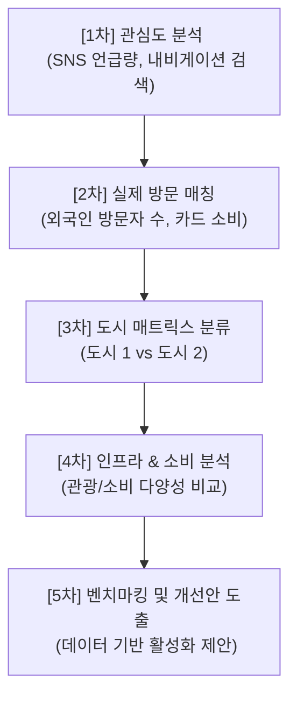

# 🗺️ 한국관광공사 API 연동 Streamlit 대시보드 세부 구현계획서

## 1. 프로젝트 정의 및 기획 의도
* **배경**: 방한 외국인 관광객의 서울/제주 등 특정 대도시 편중 현상 심화.
* **목표**: 관심도(SNS 언급, 내비게이션 검색 등)는 높으나 실제 방문 및 소비(실제 방문자 수, 카드 소비 등)로 이어지지 못하는 **잠재적 도시(도시 2)**를 발굴하고, 관심도와 방문이 모두 높은 **성공적 도시(도시 1)**의 인프라 및 소비 다양성을 벤치마킹하여 구체적인 지역 관광 활성화 방안을 제시하는 대시보드 구축.

---

## 2. 5단계 분석 프레임워크 상세 설계

대시보드 앱은 사용자가 시나리오에 따라 직관적으로 분석을 진행할 수 있도록 아래 5단계 흐름을 인터랙티브 UI로 구현합니다.



### 1차 분석: 외국인 관심 도시 분석
* **목적**: SNS 언급량 및 내비게이션 검색량 등을 활용하여 외국인들이 현재 주목하고 호기심을 가지는 도시 리스트 추출
* **사용 API**: `AreaTarResDemService` -> `getAreaTarServDemList`
* **주요 지표**: SNS 언급량(소셜 버즈량), 내비게이션 목적지 검색량

### 2차 분석: 관심도 대비 실제 방문율 검증
* **목적**: 온라인상의 관심(검색)이 오프라인에서의 실제 방문 및 소비 활동으로 전환되었는지 검증
* **사용 API**: `AreaTarDivService` -> `getAreaTarVisitorDivList`, `getAreaTarSpendDivList`
* **주요 지표**: 실제 외국인 방문자 수, 신용카드 소비액

### 3차 분석: 도시 유형 분류 (도시 1 vs 도시 2)
* **목적**: 도시별 관심도와 방문량을 축으로 하는 2x2 매트릭스 모델을 구축하여 분석 대상 도시 자동 분류
* **매트릭스 분류 모델**:
  * **도시 1 (성공 모델)**: 관심도 High - 방문/소비 High (예: 서울 마포구, 부산 해운대구 등)
  * **도시 2 (잠재/개선 모델)**: 관심도 High - 방문/소비 Low (마케팅은 성공했으나 방문 장벽이 있는 도시)
  * **분류 방식**: Streamlit 화면에서 전체 도시 분포를 산점도(Scatter Plot)로 보여주고, 사분면 중 **도시 2 영역**의 도시를 필터링하여 선택할 수 있도록 구현

### 4차 분석: 인프라 및 소비 패턴 심층 비교
* **목적**: 선택한 도시 1과 도시 2의 상세 인프라 및 소비 편중도를 비교하여 도시 2의 문제점 진단
* **비교 분석 항목**:
  * **소비 다양성**: 식음료, 쇼핑, 숙박, 여가 등 업종별 카드 소비 비중 분석 (`getAreaTarSpendDivList`)
  * **관광 다양성**: 방문객들의 연령대 분포 및 국적 비율 다양성 비교 (`getAreaTarVisitorDivList`)
  * **관광 자원 분포**: 문화 자원 대 카테고리별 내비게이션 목적지 비중 비교 (`getAreaTarCultDemList`)

### 5차 분석: 벤치마킹 및 관광 활성화 제안
* **목적**: 도시 1의 성공 요인(예: 쇼핑/숙박 인프라 조화, 다양한 국적 다변화 등) 데이터를 기반으로 도시 2가 벤치마킹해야 할 우선 개선 분야 추천
* **화면 구현**: 비교 분석 결과를 기반으로 "도시 2는 도시 1 대비 [숙박 소비 비율]이 X% 부족합니다."와 같은 데이터 기반 개선 포인트 요약 정보 자동 생성

---

## 3. Streamlit 대시보드 UI/UX 설계

### 화면 1: [Overview] 방한 트렌드 & 도시 관심도 랭킹
* 방한 외래객 월별 추이 그래프 (API 1 연동)
* 전국 시군구별 SNS 언급량 및 내비게이션 검색량 랭킹 (인기 도시 시각화)
* 전국 지도(Map) 상에 관심도 핫스팟 히트맵 매핑

### 화면 2: [Matrix] 관심도 vs 실제 방문 분석 (도시 분류)
* X축: 관심도 (SNS 언급량 / 내비 검색량)
* Y축: 실제 방문도 (외국인 방문자 수 / 카드 소비액)
* 전체 시군구 대상 산점도 및 사분면(Matrix) 영역 표시
* 사용자가 마우스 오버로 도시 정보를 확인하고, 분석할 **도시 1(대조군)**과 **도시 2(비교군)**를 선택하는 인터랙티브 필터 제공

### 화면 3: [Deep-Dive] 1:1 비교 및 벤치마킹 제안
* 선택한 두 도시의 레이더 차트(Radar Chart)를 통한 5대 지표(관광객 다양성, 소비 다양성, 국제적 다양성, SNS 언급량, 인프라 다양성) 비교
* 카테고리별 소비 비중, 연령별 분포 등 10종 이상의 다변량 시각화 차트 제공
* 데이터 기반 벤치마킹 포인트(개선 추천 영역) 텍스트 리포트 자동 생성

---

## 4. 상세 개발 로드맵

```
[1주차: API 연동 및 데이터 수집]
 - .env 구성 및 API Key 설정
 - api/odcloud_api.py 및 api/kto_api.py 작성
 - 데이터 수집 자동화 및 로컬 JSON/CSV 캐싱 파이프라인 개발

[2주차: 데이터 전처리 및 EDA]
 - 수집된 관심도/방문 데이터 정형화 및 Pandas 정비
 - 5단계 분석 시나리오 검증용 상관분석 및 기술 통계 도출
 - eda-basic 가이드라인 기반 시각화 및 한국어 분석 리포트 작성

[3주차: Streamlit 대시보드 UI 개발]
 - app.py (메인) 및 pages/ 하위 3개 분석 화면 구현
 - Plotly 인터랙티브 Scatter Matrix 및 지도 시각화 연동
 - 사용자 선택 기반 동적 비교 데이터 렌더링 최적화

[4주차: 예외 처리 및 최종 배포]
 - 공공데이터포털 트래픽 초과 시 로컬 캐시 자동 로딩 구조 확보
 - 배포용 requirements.txt 정비 및 Streamlit Cloud 배포 완료
```
